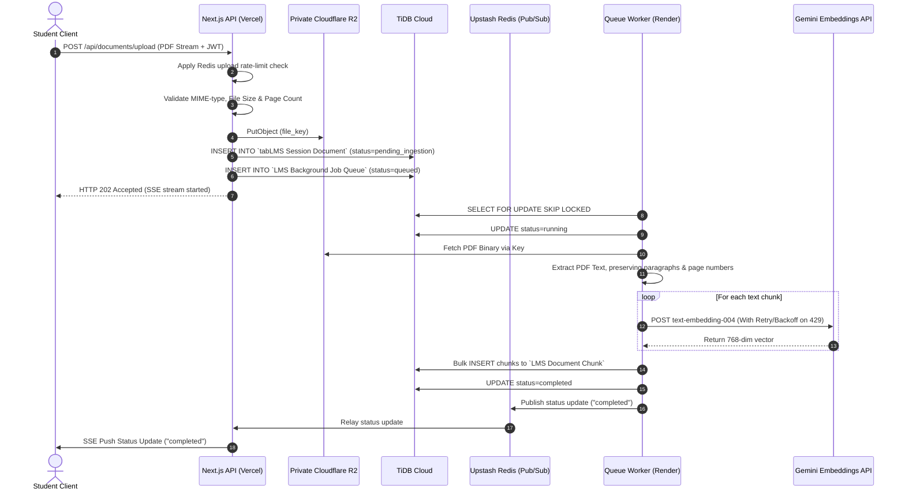
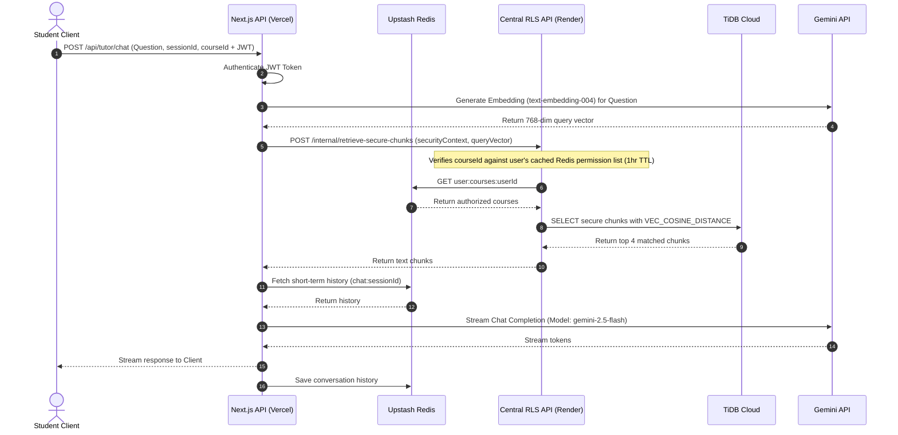

# Architectural Design & Implementation Plan: LangChain AI Agents, RAG, & TiDB Vector Search

This plan details the integration of LangChain-based AI Agents, background-queued multi-document session ingestion, hybrid (Vector + Keyword) retrieval via TiDB Vector Search, and a production-grade Row-Level Security (RLS) and Tenant Isolation architecture.

---

## 1. System Architecture & Context Verification

### 1.1 Process Standard: Review First, Redesign Second
Before introducing any new services, libraries, or schema changes, we review the existing components for reuse:
*   **Next.js API Routes**: Reuses the Node.js API server (`/api/gemini`) to run the LangChain orchestrator.
*   **Direct TiDB Connection**: Reuses the Next.js `mysql2/promise` connection pool ([`db.js`](file:///e:/vyomantha/Vyomanta/frontend/lib/db.js)).
*   **Upstash Redis**: Reuses the configured Upstash Redis instance ([`memory.js`](file:///e:/vyomantha/Vyomanta/frontend/lib/memory.js)) to store session states and conversational history.
*   **Frappe Backend**: Reuses user session table `tabSessions` and roles framework in `tabUser` / `tabUser Role` as the identity source of truth.

### 1.2 Database Vector Support Verification
As a verification step, vector support has been tested directly on the active TiDB Cloud instance by successfully executing DDL statements for `VECTOR` datatype columns.

---

## 2. Existing Architecture Overview

The LMS platform is structured as a decoupled headless system:
1.  **Frontend (Next.js)**: Hosted on Vercel. Connects to TiDB Cloud for static resource libraries and handles tutor queries.
2.  **Conversational Cache (Upstash Redis)**: Caches the sliding window of student chat histories under `chat:${sessionId}` and student facts under `memories:${userId}`.
3.  **Core LMS (Frappe)**: Hosted on Render. Stores student profile metadata, enrollment statuses, and course structures.
4.  **Database (TiDB Cloud)**: Hosts relational databases `test` (Frappe system data) and `pdf_resources_db` (global resource materials).

---

## 3. Recommended Architecture & Separation of Concerns

We enforce a strict boundary between storage layers:
*   **Conversation Memory (Ephemeral Store)**: Managed in Upstash Redis. Holds short-term conversation histories and sliding window summaries. Strictly disallowed from storing vector segments or database resource indices.
*   **Knowledge Store (Persistent Store)**: Managed in TiDB Cloud. Holds document metadata, text chunks, and vector embeddings. Strictly disallowed from storing live session conversation threads.

```
+------------------------------------------------------------------------------------------------+
|                                         DEPLOYMENT SPEC                                        |
+------------------------------------------------------------------------------------------------+
| [ Vercel (Frontend Next.js) ]                      [ Render (LMS Container & Voice Server) ]   |
|   - Serves Client React App                          - Hosts Frappe Backend Engine             |
|   - Exposes Client Chat Routes (/api/tutor/chat)     - Runs background Queue Worker process    |
|   - Validates Uploads, posts directly to R2          - Runs Voice WebSocket server             |
|   - Relays Ingestion Status via Redis Pub/Sub        - Exposes Centralized RLS API             |
+------------------------------------------------------------------------------------------------+
```

---

## 4. Cross-Origin Authentication & WebSocket Validation

Since the frontend runs on Vercel and the backend runs on Render, cookie-based session checking is vulnerable to browser cross-origin policy restrictions. We implement a unified token-based authentication mechanism.

### 4.1 Short-Lived JWT Flow
1.  **JWT Signing Endpoint**: We will write a small custom Python whitelisted API endpoint in Frappe (`api/method/vyomanta.auth.get_jwt`) to verify the active `sid` cookie, retrieve the student's `user_id` and `tenant_id`, and sign/return a short-lived JWT (e.g. 15-minute expiry).
2.  **Storage**: The token is stored securely in the frontend session state (managed by NextAuth).
3.  **API Requests**: All client-to-Next.js API requests and Next.js-to-Render backend API requests supply this token in the `Authorization: Bearer <JWT>` header.

### 4.2 WebSocket Authentication for the Voice Server
WebSocket connections do not naturally support standard HTTP authorization headers across origins. To authenticate voice WebSocket sessions:
1.  **WS Token Request**: Client makes a quick GET request `/api/auth/ws-token` to Next.js. Next.js validates the JWT session and returns a single-use WS Ticket with a 60-second expiry, saved in Upstash Redis as `ws_ticket:${ticket_id}` containing user details.
2.  **Connection Handshake**: Client initiates WebSocket connection:
    `wss://vyomanta.onrender.com/voice?ticket=TICKET_ID`
3.  **Verification**: The Voice Server on Render intercepts the connection, extracts the ticket, fetches/deletes the ticket from Redis, and resolves the authenticated security context (`tenant_id`, `user_id`, `session_id`) before allowing any RAG operations.

---

## 5. Centralized RLS API: Single Source of Truth

To prevent copy-pasting RLS logic between Next.js (Vercel) and the Voice Server (Render) and avoiding code drift, the RLS repository is hosted as an **internal-only HTTP service on Render**.

```
                Frontend Chat (Next.js on Vercel)
                                |
                                | Secure HTTP Call
                                v
      [ Render Container (Centralized RLS API endpoint) ]
      (Route: POST /internal/retrieve-secure-chunks)
      (Auth: Shared HTTP Service Token in Env Headers)
                                ^
                                | Local IPC / Secure Call
                                |
             Voice WebSocket Server (Render)
```

Both Vercel and the Voice Server query the same endpoint `POST /internal/retrieve-secure-chunks` on Render. 

### 5.1 Internal Security & Egress Protections
To protect this high-value endpoint:
*   **Shared Token**: The route verifies a strong shared `INTERNAL_SERVICE_TOKEN` in HTTP headers.
*   **Rate-Limiting**: A local rate-limiter is applied to prevent query floods.
*   **Allowlist / Signature Check**: We implement middleware signature verification using a secret key to sign payloads, ensuring queries can only be generated by Vercel or the Voice Server.

### 5.2 Server-Side Verification Flow
1.  **Resolve permissions**: The RLS API queries the user's cached permission array `user:courses:${userId}` in Redis.
    *   *TTL Safety Net*: The Redis cache keys `user:courses:${userId}` and `user:is_instructor:${userId}:${courseId}` are set with a **1-hour max TTL** safety net, ensuring stale access automatically expires if a cache invalidation hook fails.
2.  **Verify course scope**: Re-verifies that `courseId` exists inside the user's cached permission list. If not present, access is blocked.
3.  **Resolve Role**: Determines if the user is an instructor via `user:is_instructor:${userId}:${courseId}`.
4.  **Execute SQL**: Runs the parameterized SQL query against TiDB Cloud:
    ```sql
    SELECT id, document_id, content, page_number, 1 - VEC_COSINE_DISTANCE(embedding, ?) AS similarity
    FROM `LMS Document Chunk`
    WHERE tenant_id = ? AND session_id = ?
      -- Apply dynamic role constraints:
      AND (? = 1 OR user_id = ?)
    HAVING similarity >= ?
    ORDER BY similarity DESC
    LIMIT ?;
    ```
5.  **Log Audits**: Logs the retrieval event to `LMS RAG Audit Log` for compliance.

### 5.3 Invalidation Hooks & Redis Config
*   ** hooks**: Python hooks on Frappe's `LMS Enrollment` and `Course Instructor` clear cached permission keys in Upstash Redis whenever a student enrolls or instructor assignment changes.
*   **Environment Configuration**: The Frappe container requires the Upstash Redis credentials (`UPSTASH_REDIS_REST_URL` and `UPSTASH_REDIS_REST_TOKEN`) in its environment to publish invalidation events.

---

## 6. Database Schema Design

*   *Naming Note*: Custom tables bypass Frappe ORM and use standard naming conventions (no `tab` prefix) to clearly separate them from Frappe-managed DocTypes.

### 6.1 Frappe DocType: `tabLMS Session Document`
Tracks document metadata. Enforces a **Session-to-Many-Documents** relationship.
```sql
CREATE TABLE `tabLMS Session Document` (
    name VARCHAR(140) PRIMARY KEY,       -- Document UUID
    creation DATETIME(6) NOT NULL,
    modified DATETIME(6) NOT NULL,
    modified_by VARCHAR(140) NOT NULL,
    owner VARCHAR(140) NOT NULL,          -- Uploader user email
    docstatus TINYINT NOT NULL DEFAULT 0,
    file_name VARCHAR(255) NOT NULL,
    file_key VARCHAR(255) NOT NULL,       -- Cloudflare R2 object key
    session_id VARCHAR(140) NOT NULL,    -- Session ID
    course_id VARCHAR(140) NOT NULL,     -- Course context
    tenant_id VARCHAR(140) NOT NULL,     -- Tenant ID (No DEFAULT)
    status VARCHAR(50) NOT NULL,         -- 'pending_ingestion', 'processing', 'completed', 'failed'
    INDEX idx_session_docs (tenant_id, session_id),
    INDEX idx_owner_docs (tenant_id, owner)
);
```

### 6.2 Raw TiDB Table: `LMS Document Chunk`
Optimized for high-volume vector search.
```sql
CREATE TABLE `LMS Document Chunk` (
    id VARCHAR(140) PRIMARY KEY,         -- Chunk UUID
    document_id VARCHAR(140) NOT NULL,   -- Foreign Key to `tabLMS Session Document`
    session_id VARCHAR(140) NOT NULL,    -- Session ID
    user_id VARCHAR(140) NOT NULL,       -- Owner email
    course_id VARCHAR(140) NOT NULL,     -- Course ID
    tenant_id VARCHAR(140) NOT NULL,     -- Tenant ID (No DEFAULT)
    chunk_index INT NOT NULL,
    page_number INT NOT NULL,            -- Page index metadata for UI references
    content TEXT NOT NULL,               -- Plain text segment
    embedding VECTOR(768) NOT NULL,      -- Vector representation (Gemini text-embedding-004)
    embedding_model VARCHAR(100) NOT NULL,
    embedding_version VARCHAR(20) NOT NULL,
    created_at TIMESTAMP DEFAULT CURRENT_TIMESTAMP,
    VECTOR INDEX idx_embedding ((VEC_COSINE_DISTANCE(embedding))),
    INDEX idx_sec_lookup (tenant_id, user_id, session_id),
    CONSTRAINT fk_document FOREIGN KEY (document_id) REFERENCES `tabLMS Session Document`(name) ON DELETE CASCADE
);
```

### 6.3 Database-Backed Task Queue: `LMS Background Job Queue`
Processed by the queue worker running on Render.
```sql
CREATE TABLE `LMS Background Job Queue` (
    id BIGINT AUTO_INCREMENT PRIMARY KEY,
    document_id VARCHAR(140) NOT NULL,
    tenant_id VARCHAR(140) NOT NULL,
    status VARCHAR(50) NOT NULL DEFAULT 'queued', -- 'queued', 'running', 'completed', 'failed'
    attempts INT NOT NULL DEFAULT 0,
    max_attempts INT NOT NULL DEFAULT 3,
    error_message TEXT,
    created_at TIMESTAMP DEFAULT CURRENT_TIMESTAMP,
    updated_at TIMESTAMP DEFAULT CURRENT_TIMESTAMP ON UPDATE CURRENT_TIMESTAMP,
    INDEX idx_queue_lookup (status, created_at)
);
```

---

## 7. Cloudflare R2 Storage Security

The system uses **Cloudflare R2** for file storage.
*   **Storage Rule**: Documents are uploaded directly to a private R2 bucket. Next.js/Render store only the `file_key` inside `tabLMS Session Document`. They never store or expose public URLs.
*   **Access Control & Signed URLs**: When a client requests access to read a document (e.g., in the workspace panel), the server validates the security context (tenant, user, session ownership) and generates a short-expiry S3-compatible signed URL (valid for 5 minutes) via the AWS SDK:
    ```javascript
    const command = new GetObjectCommand({ Bucket: R2_BUCKET, Key: document.file_key });
    const signedUrl = await getSignedUrl(s3Client, command, { expiresIn: 300 });
    ```
    This prevents leaked file URLs from bypassing RLS controls.

---

## 8. Ingestion & RAG Pipelines

### 8.1 Ingestion Pre-Queue Validation & Rate-Limiting
Prior to queueing an upload, the API validates the file to control resource consumption:
1.  **Rate-Limiting**: Upload requests are throttled at `/api/documents/upload` using Upstash Redis window counters (e.g., maximum 5 uploads per hour per user).
2.  **MIME-type Check**: Rejects files whose magic bytes do not match `application/pdf`.
3.  **Size Cap**: Files larger than 10MB are rejected.
4.  **Page Count**: Lightweight stream headers are scanned to extract `/Type /Page` counts. Files containing more than 50 pages are rejected.

### 8.2 Worker Ingestion & SSE Relaying
*   **Worker Execution (Render)**: The worker runs on Render. To coordinate multi-instance worker processes safely and prevent lock contention, the worker fetches tasks using a row-locking query:
    ```sql
    SELECT * FROM `LMS Background Job Queue`
    WHERE status = 'queued'
    ORDER BY created_at ASC
    LIMIT 1
    FOR UPDATE SKIP LOCKED;
    ```
*   **Retry & Backoff**: If chunking or embedding fails, the worker increments `attempts` and schedules a retry with exponential backoff. If `attempts >= max_attempts`, the status is set to `failed` (acting as a dead-letter queue).
*   **Embedding Resiliency**: When calling Gemini `text-embedding-004` to generate vectors, the worker applies a per-chunk retry with exponential backoff on `429` (rate limits) to prevent transient API errors from failing the entire document upload.
*   **SSE Relayer Flow**: Vercel functions cannot handle direct SSE pushes from the Render worker. Instead:
    1.  The worker writes state updates (`processing`, `completed`, `failed`) to the database and publishes a status event to Upstash Redis Pub/Sub under `document:status:${documentId}`.
    2.  The Next.js SSE endpoint on Vercel `/api/documents/status-stream` subscribes to the Redis Pub/Sub channel (with a database poll fallback).
    3.  Next.js relays these event payloads directly to the browser client.

### 8.3 Chunking Strategy
We apply a concrete text split strategy to ensure retrieval quality:
*   **Chunk Size**: 1000 characters.
*   **Overlap**: 200 characters.
*   **Paragraph Boundary Preservation**: Splits on double newlines `\n\n` first, then single newlines `\n`, then spaces, to keep logical concepts intact.
*   **Metadata Integration**: The worker extracts page numbers during parsing and stores them in the `page_number` column of `LMS Document Chunk`, allowing RAG outputs to display exact page citations.

---

## 9. Sequence Diagrams

### 9.1 Document Upload & Ingestion Flow



### 9.2 Chat & Retrieval Flow



---

## 10. Implementation Plan & Phase-by-Phase Build Order

We enforce a strict 6-phase deployment checklist that isolates changes and keeps the existing LMS fully operational at every stage.

### Phase 1: Schema Setup (No code changes)
1.  **LMS Session Document DocType**: Create `LMS Session Document` inside Frappe and run `bench migrate`.
2.  **Raw SQL Tables**: Execute SQL statements in TiDB to provision `LMS Document Chunk`, `LMS Background Job Queue`, and `LMS RAG Audit Log`.
3.  **Indexing**: Apply relational composite indexes (`idx_sec_lookup`) and vector HNSW indexes (`idx_embedding`).
4.  **Verification**: Confirm existing LMS courses, enrollments, and user logins are unaffected.

### Phase 2: Backend Plumbing (No user-facing changes)
5.  **Centralized RLS API Endpoint**: Host `POST /internal/retrieve-secure-chunks` on Render. Code it to validate `courseId` permissions against cached Redis permissions. Write unit tests targeting cross-user and cross-tenant retrieval inputs to ensure they are blocked.
6.  **Queue Worker on Render**: Set up the database-polling worker process on Render incorporating `SKIP LOCKED` updates. Run permission cache invalidation hooks in Frappe to keep Redis permissions clean.
7.  **Upload Endpoint**: Implement `/api/documents/upload` on Next.js with rate-limiting, MIME-type, size, and page limits. Connect it to write files to the private R2 bucket and register tasks in the database queue. Test exclusively via isolated POST requests (curl/Postman).

### Phase 3: Ingestion Pipeline (Dark-launched)
8.  **Worker Processing Logic**: Connect the worker parser, splitter, and embedding pipeline. Include chunking constraints (1000 size, 200 overlap, paragraph splits) and embedding rate-limit retry logic. Upload test PDFs to trigger the queue and verify vector records write cleanly to `LMS Document Chunk`.
9.  **Status Monitoring**: Ensure status updates transition correctly from `pending_ingestion` -> `processing` -> `completed`/`failed` in the database.

### Phase 4: Retrieval API (Isolated)
10. **Retrieval Endpoint**: Build `/api/tutor/chat` as a brand new route on Next.js. Connect it to call the Central RLS API on Render. Test RAG querying in isolation.
11. **Fallback Verification**: Verify that querying `/api/tutor/chat` for a session with no uploaded documents behaves exactly like the plain chat system (returning standard Gemini responses with no failures).

### Phase 5: Lifecycle & Safety Net
12. **Cleanup Routines**: Program the cascade deletion logic and the daily session-expiry cron job. Execute test session deletions and verify related Redis keys, DB chunks, and private R2 files are completely wiped.

### Phase 6: UI & Production Rollout
13. **UI Integration**: Add the document upload UI trigger and point frontend chat components to the new `/api/tutor/chat` route instead of `/api/gemini`.
14. **Rollback Target**: Keep `/api/gemini` active and untouched. In case of issues, swap frontend routes back to the fallback path.
15. **Production Release**: Perform a phased rollout to 5% of users, monitoring audit logs and query latency before expanding.

---

## 11. Non-Functional Requirements (NFR)

*   **UI/UX Scope**: No changes to existing UI; new document upload/chat UI is additive.
*   **Backward Compatibility**: Chat routes fall back gracefully to standard tutoring pipelines if RAG documents are not present in a session.
*   **Downtime Minimization**: Relational schema migrations are backward compatible.
*   **Scale**: The HNSW index on TiDB enables sub-100ms vector query execution times on millions of chunk records.
*   **Tenant Isolation**: Data isolation is enforced strictly at the centralized query boundary by verifying the authenticated security context.
*   **Monitoring & Observability**: System performance metrics (embedding latency, vector search speed, and cache hit ratios) will be instrumented using OpenTelemetry.
*   **Cost Management**: Monitor TiDB vector storage and query costs at expected chunk volume regularly.

---

## 12. Operational Process Standard

When revising or extending this implementation plan:
1.  **Review First, Redesign Second**: Check for existing DocTypes, connection pools, and caching mechanisms before proposing additions.
2.  **Phased Transitions**: Maintain backward compatibility across all migration phases.
